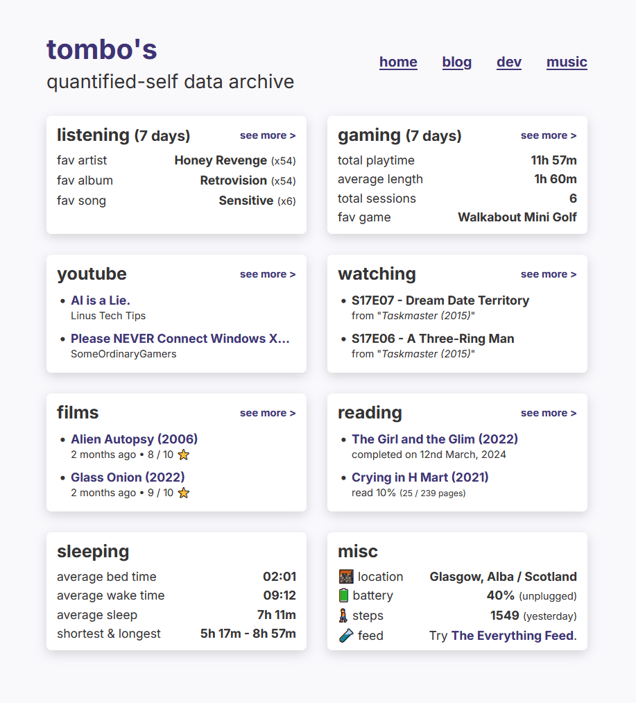
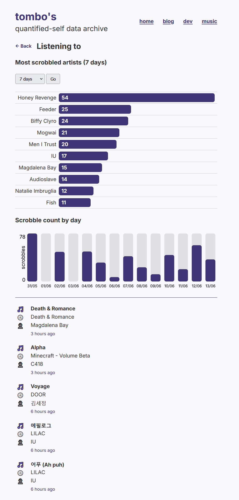

# Everything (Quantified-Self Data Tracker)

Taking ownership of my data is important to me. While I can't get the very
granular details that the likes of Google and TikTok can (e.g. watch time of
specific parts of videos down to the millisecond⁉), I like to collect as much as
I can, so that if any one services gets shut down, I'll still have my own copy.
Furthermore, I'm making a lot of it public so that advertisers don't have quite
an upperhand on the things I like to consume.

If this also applies to you, you might consider using Tombo-Everything (for lack
of a better name!).

## Screenshots

For an actual live demo of my data collection, visit
<https://now.tomgardiner.me>, otherwise here are a couple of screenshots:

This is the landing page dashboard - it contains a brief overview of everything
being collected (that you'd want public, anyway), and - where it makes sense to
view more details - you can click `see more >` to view individual tracking
records. For example, here's the music page:

Some pages have graphs and tables for some interesting visualisations, however
most just have records like the ones you see at the bottom of this screenshot.

## Data Collection & Sources

There are various types of data that can be stored, half of which is completely
automatic, and another half which may require manual input (until I figure out a
better way to do it).

### Automatic/External

* **Location Tracking** - Using the
  [Overland API](https://github.com/aaronpk/Overland-iOS#api) by
  [Aaron Parecki](https://aaronparecki.com/). Also updates latest phone battery.
* **Scrobbles** - Custom implementation of the
  [ListenBrainz API](https://listenbrainz-server.readthedocs.io/en/latest/dev/api.html),
  by pointing your scrobbler to `/api/listenbrainz`.
* **YouTube Likes** - Polls the
  [Google API](https://developers.google.com/youtube/v3/) to get newly liked
  videos, automate POST requests using IFTTT, Zapier or equivalent, or by
  posting a message in Discord.  
  By default, the Google API limits refresh tokens to 7 days, so I've found this
  to be unreliable.
* **Video game activity and achievements/trophies**:
  * [**Steam**](https://store.steampowered.com/): Polls the
    [Steam Web API](https://developer.valvesoftware.com/wiki/Steam_Web_API)
  * [**PSN**](https://www.playstation.com/playstation-network/): Polls the
    [PSN API](https://github.com/achievements-app/psn-api)
  * [**RetroAchievements**](https://retroachievements.org/): Polls the
    [RetroAchievements API](https://api-docs.retroachievements.org/)
* **Films/Movies** - Polls your [Letterboxd](https://letterboxd.com) profile for
  newly logged films to your diary.
* **Card purchases** - Create a
  [Monzo webhook](https://docs.monzo.com/#webhooks) to automatically POST to
  `/api/purchases` whenever you make a purchase (or get paid).

### Manual Data Entry

Data is entered using the internal CRUD API.

* **Health** - All hidden from public view except sleep, which is heavily
  aggregated.
  * Sleep
  * Time-tracking
  * Steps
  * Food
  * Weight
* **TV Shows** - [Sonarr](https://sonarr.tv/) installed locally, to get a list
  of series and episodes to pick from.
* **Scrobbles** - [Subsonic API](http://www.subsonic.org/pages/api.jsp)
  installed locally, to get a list of artists and their albums (this is great
  for listening to physical media, where scrobbling is not automatic).
* **Books** - Stores progress using page numbers (eg. if you've read 48 pages,
  and there are total 230 pages, the progress is therefore 21%)
* **Web Bookmarks**

## Discord Bot

By providing `TOMBOIS_DISCORD_TOKEN` and `TOMBOIS_DISCORD_CHANNELID` environment
variables, and creating a custom Discord bot to join a personal server, you can
have a quick way to post data to the site, which also works quite well with
automation services who are restricting webhooks behind a paywall (but haven't
yet made Discord a paid feature).

It currently supports these commands, following this format:

* **YouTube:**  
  Usage: `youtube <URL> [optional date/time, in ISO format]`  
  Examples:
  * `youtube https://www.youtube.com/watch?v=Ku6nJjmEeaw`
  * `youtube https://youtu.be/BpfXVC9lQnk 2024-02-23T10:45:20.000Z`
* **Bookmarks:**  
  Usage: `bookmark <URL> <TITLE>`  
  Example:
  * `bookmark https://www.tombofry.co.uk TomboFry - 8-Bit / Chiptune Music`

## Installation

### Prerequisites

* Copy `.env.template` to `.env` and modify values as you see fit. **Most of the
  setup instructions you'll need already appear within the .env file**, as they
  are specific to each service you'd like to track.
* Start the server and open the internal API: it'll prompt you to set up a new
  device.
* Add the new device ID to the `TOMBOIS_DEFAULT_DEVICE_ID` variable in `.env`.
* Now that you've gotten a device added, you can restart the server and start
  collecting data!
* ⚠ **Note:** You will likely want to change the homepage layout and specific
  theming elements of the site, you can do this by changing the styles in
  `public/style.css` and the various templates in `src/views`. If you're running
  this on Docker, you'll need to rebuild the image any time you make a change.

### Running via NPM on bare metal

* `npm install`
* `npm run build`
* `npm run start:production` (or your preferred way of managing node
  applications, eg. `forever`, `pm2`, etc)

### Running via Docker

The `Dockerfile` and `docker-compose.yml` have been set up in such a way that
you should only need to edit the `.env` file to make configuration changes. As
such, all that's required is:

* `docker compose up -d`

## API / Connecting applications

The [API documentation page](./API.md) contains a full list of endpoints and
their requirements.
